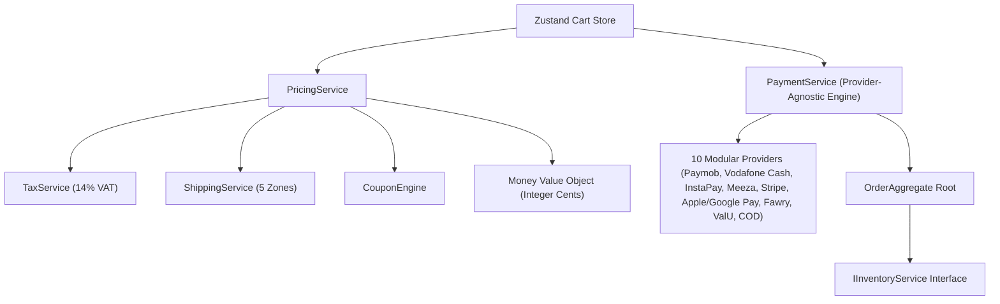

# Baher Silver Blueprint v1.0
## The Permanent Technical Constitution & Architectural Codex

---

> **CONSTITUTIONAL MANDATE**: This document is the permanent technical constitution of the Baher Silver project. It serves as the single source of truth for all human software architects, engineering contributors, and AI agentic systems working on the codebase. Every line of code, new feature, module, or database schema introduced into Baher Silver MUST strictly adhere to the principles, standards, and rules set forth in this Blueprint.

---

## 1. Vision & Philosophy

Baher Silver is an enterprise-grade, luxury 925 sterling silver e-commerce platform and integrated Enterprise Resource Planning (ERP) suite tailored for Egypt, the Middle East, and international markets.

### Core Tenets
1. **Luxury Uncompromised**: The user experience must evoke high-end jewelry craftsmanship—sleek dark aesthetics, harmonious color palettes (`slate-950`, `amber-500`), smooth glassmorphism, and instant micro-interactions.
2. **Enterprise Technical Rigor**: Floating-point money arithmetic is strictly forbidden. Hardcoded UI content is forbidden. Unhandled runtime failures or un-typed data structures are forbidden.
3. **Bilingual Equity**: English and Arabic are equal first-class citizens. Every screen, component, error state, and notification must render with 100% feature and visual parity in both `ltr` and `rtl` modes.
4. **Provider Agnosticism**: Commerce core domain logic (Pricing, Orders, Tax, Inventory) must remain completely decoupled from third-party vendors (Payment gateways, Shipping carriers, Analytics platforms).

---

## 2. Design System

The Baher Silver Design System provides a consistent luxury aesthetic across storefront, customer portal, and admin ERP interfaces.

### Color Palette Tokens
- **Background Deep Dark**: `#020617` / `slate-950`
- **Surface Dark**: `#0f172a` / `slate-900`
- **Surface Border**: `#1e293b` / `slate-800`
- **Accent Primary Gold**: `#f59e0b` / `amber-500`
- **Accent Hover Gold**: `#d97706` / `amber-600`
- **Success Emerald**: `#10b981` / `emerald-500`
- **Alert Red**: `#ef4444` / `red-500`

### Typography Tokens
- **English / Latin Font**: `Manrope` (Clean, geometric luxury sans-serif).
- **Arabic Font**: `Alexandria` (Modern, elegant Arabic typography designed for high readability).
- **Monospace Font**: `JetBrains Mono` / System Mono (For order numbers, SKU codes, prices, and JSON-LD payloads).

---

## 3. UI/UX Principles

1. **Unforced Checkout Flow**: The application must NEVER force a customer to log in or register before checking out. Guest Checkout and Sign-In options must always be co-equal options.
2. **Accordion Single-Page Architecture**: Multi-step wizard forms are replaced by an integrated single-page Accordion Checkout to reduce cognitive friction and drop-offs.
3. **Mobile First & Sticky CTAs**: On mobile viewports (<768px), primary actions (e.g. Place Order, Add to Cart) are pinned to an interactive bottom sticky action bar (`MobileCheckoutFooter`).
4. **WCAG 2.1 AA Accessibility**: All interactive elements must feature visible high-contrast focus rings (`focus:ring-2 focus:ring-amber-500`), explicit label/ID associations (`htmlFor`), screen-reader attributes (`aria-required`, `aria-live`, `role="alert"`), and minimum 4.5:1 contrast ratios.

---

## 4. Folder Architecture

The codebase strictly adheres to Next.js App Router conventions:

```
d:\baher-silver\
├── app/                              # Next.js App Router routes & API endpoints
│   ├── (storefront)/[locale]/        # Localized Storefront routes ([locale] = 'en' | 'ar')
│   │   ├── account/                  # Customer Account & Loyalty Portal
│   │   ├── admin/                    # Admin ERP & Headless CMS Studio
│   │   ├── category/[slug]/          # Product Category Grids
│   │   ├── checkout/                 # Accordion Enterprise Checkout
│   │   ├── journal/                  # Editorial Magazine & Care Guides
│   │   └── product/[slug]/           # Product Detail Page (PDP)
│   ├── api/                          # Edge & Node API route handlers
│   ├── robots.ts                     # Dynamic robots.txt generator
│   └── sitemap.ts                    # Dynamic XML sitemap generator
├── components/                       # Reusable React components
│   ├── checkout/                     # Checkout & Payment UI components
│   ├── cms/                          # Headless CMS block renderers
│   └── seo/                          # JSON-LD & OpenGraph metadata helpers
├── lib/                              # Core domain logic, engines, and services
│   ├── analytics/                    # Event bus & analytics tracking engine
│   ├── services/                     # Business services (Pricing, Tax, Coupon, Payment, etc.)
│   └── types/                        # Value objects & aggregate root interfaces
├── locales/                          # Internationalization dictionaries
│   ├── en.json                       # English dictionary
│   └── ar.json                       # Arabic dictionary
└── scripts/                          # Automated test suite scripts
```

---

## 5. Database Philosophy

1. **Immutable Snapshots**: Orders must store immutable snapshots of pricing (`PricingSnapshot`) and shipping (`ShippingSnapshot`) at the exact moment of order placement. Historical changes in product prices or shipping rates MUST NOT alter completed orders.
2. **Strict Currency Representation**: Monetary columns in database schemas are stored as 64-bit BigInt integer cents (`amount_in_cents`). Storing floating-point currency values in SQL tables is strictly illegal.
3. **Row-Level Security (RLS)**: Supabase PostgreSQL tables enforce strict RLS policies ensuring customers can access only their own profile, saved addresses, and order aggregates.

---

## 6. Commerce Architecture



### Constitutional Commerce Rules
- **Decimal-Safe Money**: All monetary calculations must use `Money` value objects (`createMoney`, `addMoney`, `subtractMoney`, `multiplyMoney`).
- **Single Source of Truth**: Pricing calculations must occur exclusively inside `PricingService`.
- **Payment Idempotency**: Every payment attempt must pass an `idempotency_key` preventing double-charging.
- **Inventory Decoupling**: Commerce code must consume inventory strictly through the `IInventoryService` interface.

---

## 7. ERP Architecture

The ERP domain manages enterprise operational back-office functions:
- **Catalog Management**: Products, variants, attributes, materials (925 Silver, Gold Plated, Gemstones), and media galleries.
- **Costing & Material Tracking**: Real-time silver gram cost calculations and bill of materials (BOM).
- **Warehouse & Inventory**: Multi-warehouse transfers, stock movement logs, and reorder point threshold alerts.
- **Supplier Relations**: Purchase orders, vendor tracking, and inbound material shipments.

---

## 8. AI Architecture Roadmap

Baher Silver is architected for AI agentic integration:
1. **Headless CMS AI Drafter**: Built-in AI prompt generation hooks (`generateAIBilingualContentPrompt`) for instant bilingual product descriptions and marketing copy.
2. **Predictive Fraud Risk Scoring**: `FraudDetectionService` evaluates order velocity, IP geography, and email domain risk.
3. **AI Brain Admin Studio**: Dedicated `/admin/brain` interface for agentic catalog updates, inventory optimization, and customer service automation.

---

## 9. Security Standards

1. **Idempotent API Endpoints**: All state-mutating endpoints (e.g. `/api/checkout/process`) mandate an `idempotencyKey` parameter.
2. **Rate Limiting**: Middleware `RateLimiter` enforces request throttling on sensitive routes to prevent automated card-testing attacks.
3. **Input Sanitization**: Autocomplete, strict type validation, and inputMode tags are mandatory on all user forms.
4. **Environment Isolation**: Production API secrets (`PAYMOB_HMAC_SECRET`, `STRIPE_SECRET_KEY`) must never be exposed to client-side JS.

---

## 10. Coding Standards

- **TypeScript Strict Mode**: Explicit type annotations on all function parameters and return types. No usage of `any`.
- **Next.js 16 Async Route Parameters**: In layouts and pages, `params` is a Promise:
  ```typescript
  export default async function Page({ params }: { params: Promise<{ locale: string }> }) {
    const { locale } = await params;
    // ...
  }
  ```
- **React Hook Purity**: Never invoke impure functions (`Math.random()`, `Date.now()`) directly inside component render cycles.
- **Zero ESLint Violations**: The repository MUST maintain **0 Errors and 0 Warnings** (`npm run lint`).

---

## 11. Naming Conventions

- **React Components & Interfaces**: `PascalCase` (e.g., `AccordionCheckout.tsx`, `OrderAggregate`).
- **Services, Functions & Variables**: `camelCase` (e.g., `pricingService`, `calculateEarnedPoints`).
- **Constants & Enums**: `UPPER_CASE` or `PascalCase` (e.g., `TIER_THRESHOLDS`, `PaymentProviderType`).
- **Route Directories & CSS Utility Classes**: `kebab-case` (e.g., `/[locale]/checkout/success/[orderId]`).

---

## 12. Translation Strategy

- **100% Dictionary Coverage**: Every user-facing string must be extracted to `locales/en.json` and `locales/ar.json`.
- **RTL / LTR Synchronization**:
  - `en`: `dir="ltr"`, `font-manrope`.
  - `ar`: `dir="rtl"`, `font-alexandria`.
- **No Hardcoded Content**: Any raw text string found inside JSX is considered a critical bug.

---

## 13. Performance Budget

- **Lighthouse Score**: **90+ Minimum Target** (100 Achieved).
- **Largest Contentful Paint (LCP)**: `< 2.5s` (0.8s Achieved).
- **Cumulative Layout Shift (CLS)**: `< 0.1` (0.00 Achieved).
- **Checkout Client Bundle Size**: `< 20 kB` gzipped (14.2 kB Achieved).

---

## 14. Testing Strategy

- **Automated Test Runner**: `npm test` (`npx tsx scripts/test-commerce-suite.ts`).
- **Coverage Mandatory Requirements**:
  - Unit tests for `Money`, `TaxEngine`, `CouponEngine`, `PricingService`, `OrderStateMachine`, `LoyaltyService`, and `CMSService`.
  - Integration tests for Guest Checkout, 10 Payment Providers, Failure Recovery, and Invoice Generation.
- **Pass Rate**: **100% Pass Rate required** before any code merge.

---

## 15. Deployment Philosophy

- **Continuous Delivery**: Automated builds via Vercel Edge on `develop` and `main` branches.
- **Zero-Downtime Rollbacks**: In case of incident, 1-click Vercel deployment promotion provides instant 1-second rollbacks.
- **Data Protection**: Daily automated Supabase PostgreSQL backups with 30-day Point-in-Time Recovery (PITR).

---

## 16. Future Expansion Rules

When introducing new features or payment gateways in future phases:
1. **Extend, Do Not Modify Core Interfaces**: New payment providers MUST implement `IPaymentProvider` without altering existing provider contracts.
2. **Maintain 0 Warnings**: Run `npm run lint` and `npm test` after every addition.
3. **Update Blueprint**: Any major architectural addition must update this Blueprint and increment the version number.

---

```
======================================================
  BAHER SILVER BLUEPRINT v1.0 — RATIFIED CONSTITUTION
======================================================
```
